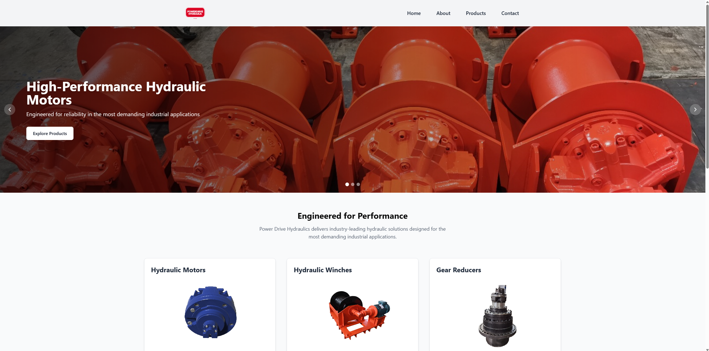

> [!WARNING]
> This is still a work in progress, many things are subject to change.


# Power Drive Hydraulics Website


A modern static website for Power Drive Hydraulics, showcasing hydraulic systems, motors, and industrial solutions. Built for performance and ease of maintenance.

**[Live Demo](https://bisque-eagle-269476.hostingersite.com/)**



## Features

- 🚀 **Responsive Design**: Mobile-first layout with TailwindCSS
- 🔍 **Product Catalog**: Display of hydraulics and motors
- 📞 **Contact Integration**: Direct email/phone links
- 🛠 **Modular Components**: Built with ShadCN/UI and React

## Tech Stack

- **Frontend**: Vite, React 18, TypeScript, TailwindCSS, ShadCN/UI Component Library, ESLint + Prettier
- **Backend**: Spring Boot(Data JPA, Security, Web, PostgreSQL Driver, DevTools), Java 17, PostgreSQL
- **Hosting**: [Hostinger]

# Getting Started & Installation

Clone the repository:
   ```bash
   git clone https://github.com/MexMass/power-drive-hydraulics.git
   
   ```

## Frontend

### Prerequisites

- Node.js ≥18.x
- npm ≥9.x

1. Install dependencies:
    ```bash
    cd .\power-drive-hydraulics\frontend\
    npm install
    ```

3. Configure environment variables (create .env):
    ```bash
    VITE_API_BASE_URL= # If applicable
    VITE_GA_TRACKING_ID= # Google Analytics
    ```

4. Start the development server:
    ```bash
    npm run dev
    ```

### Scripts
| Command           | Description                                       |
|-------------------|---------------------------------------------------|
| `npm run dev`     | Start local dev server (port 5173)                |
| `npm run build`   | Production build (output: `/dist`)                |
| `npm run lint`    | Run ESLint + TypeScript checks                    |
| `npm run preview` | Preview production build locally                  |

## License
Distributed under the MIT License. See **[LICENSE](./LICENSE)** for details.


Built by **[MexMass](https://github.com/MexMass)** • **[LinkedIn](https://www.linkedin.com/in/lukas-ramonas-215a2a14b/)** • :shipit: